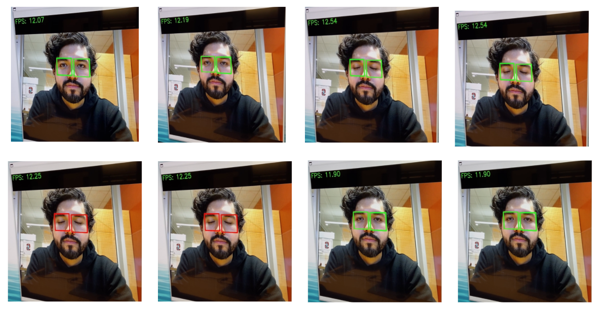

# Drowsy Driver Recognition

## Introduction

Stanford EE292D Project to detect drowsy drivers using the Coral baord with Edge
TPU. The project uses the MediaPipe facemesh model and our own image
classification model to classify bewteen eyes open and eyes closed.

## Results
After ~2s of the person in the camera having their eyes closed it displays
red squares on the area where the eyes were detected.

